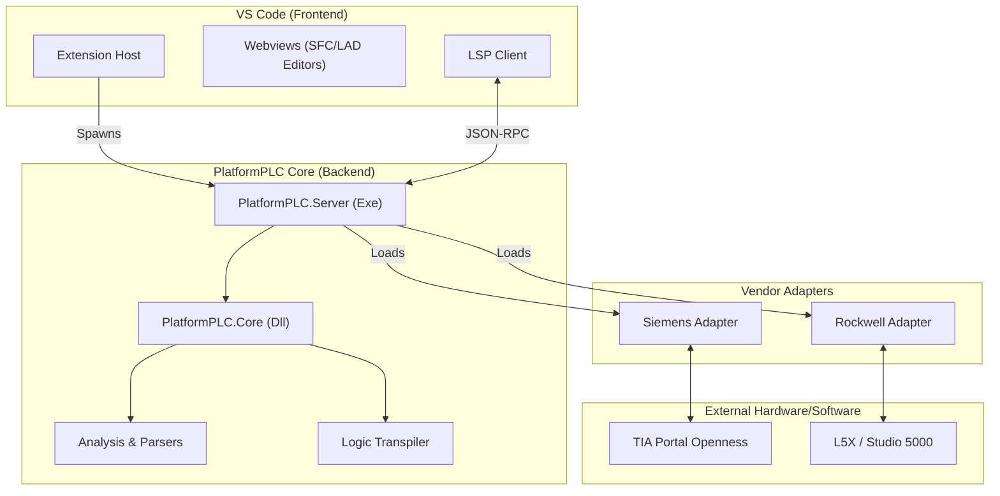
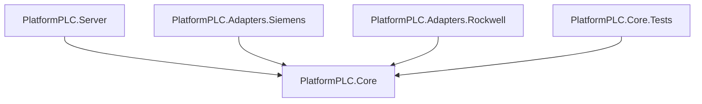
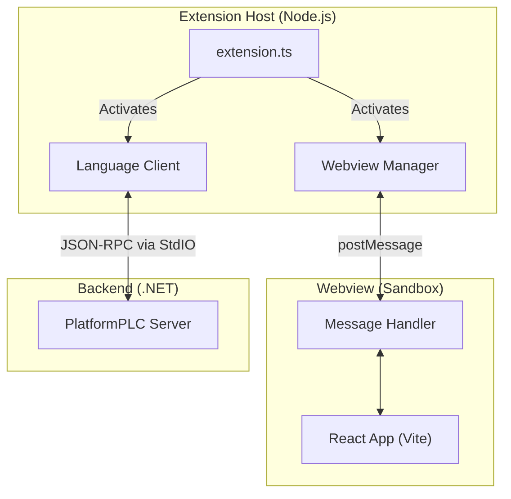

# PlatformPLC Design Overview

This document outlines the architectural design, file structure, and technical decisions for the PlatformPLC project.

## 1. High-Level Architecture

PlatformPLC is a **Monorepo** designed to bridge the gap between modern software tooling and industrial automation. It consists of three distinct layers:

1.  **Frontend (VS Code Extension)**: The user interface and editor.
2.  **Backend (The Core)**: A .NET-based Language Server and Logic Engine.
3.  **Middleware (Adapters)**: Plugins to communicate with proprietary vendor software.



## 2. Repository Structure

We utilize a **Consolidated Core** approach to minimize project overhead while keeping vendor dependencies isolated.

```text
PlatformPLC/
├── .github/                 # CI/CD Workflows
├── docs/                    # Architecture & Usage Documentation
├── src/                     # Source Code
│   ├── PlatformPLC.sln      # Main .NET Solution
│   │
│   ├── Core/                # The Application Logic
│   │   ├── PlatformPLC.Core/          # Shared Logic (Models, Analysis, Transpiler)
│   │   ├── PlatformPLC.Server/        # LSP Host Executable (The Entry Point)
│   │   └── PlatformPLC.Core.Tests/    # Unit Tests
│   │
│   ├── Adapters/            # Vendor Drivers
│   │   ├── PlatformPLC.Adapters.Siemens/
│   │   └── PlatformPLC.Adapters.Rockwell/
│   │
│   └── Extension/           # VS Code Extension (Frontend)
│       ├── resources/       # Icons and media
│       ├── src/             # Main Extension Code (Node.js)
│       │   ├── commands/    # Command implementations
│       │   ├── panels/      # Webview Managers (The Backend for UI)
│       │   ├── lsp/         # Language Client Configuration
│       │   └── extension.ts # Entry Point
│       ├── webviews/        # React/Vite Apps (The UI)
│       │   ├── sfc-editor/  # SFC Logic Editor
│       │   └── lad-editor/  # LAD Logic Editor
│       └── package.json
│
└── examples/                # Sample Projects
```

## 3. .NET Solution Detail (`src/PlatformPLC.sln`)

The backend is organized into 5 C# projects.

### Dependency Graph



### Project Breakdown

#### A. `PlatformPLC.Core` (Class Library)
*The "Brain" of the operation.*
-   **Location**: `src/Core/PlatformPLC.Core/`
-   **Namespace**: `PlatformPLC.Core`
-   **Responsibilities**:
    -   **Models**: Defines `Tag`, `Udt`, `PlcBlock` and other universal data structures.
    -   **Interfaces**: Defines `IVendorAdapter` that all adapters must implement.
    -   **Analysis**: Contains ANTLR4 parsers for SCL/Structured Text.
    -   **Transpiler**: Logic to convert the Universal AST into vendor-specific code.
-   **Dependencies**: None.

#### B. `PlatformPLC.Server` (Console App)
*The "Runner".*
-   **Location**: `src/Core/PlatformPLC.Server/`
-   **Namespace**: `PlatformPLC.Server`
-   **Responsibilities**:
    -   **Entry Point**: The executable interacting with VS Code standard input/output.
    -   **LSP Host**: Implements the Language Server Protocol (OmniSharp/C# LSP).
    -   **Orchestrator**: Loads the project configuration and instantiates the correct adapter.
-   **Dependencies**: `PlatformPLC.Core`

#### C. `PlatformPLC.Adapters.*` (Class Libraries)
*The "Translators".*
-   **Siemens**: Implements `IVendorAdapter` for TIA Portal Openness.
-   **Rockwell**: Implements `IVendorAdapter` for Logix Designer (.L5X generation).
-   **Note**: Kept separate to ensure heavy vendor DLLs (like `Siemens.Engineering.dll`) do not contaminate the core logic.

#### D. `PlatformPLC.Core.Tests` (xUnit)
-   **Location**: `src/Core/PlatformPLC.Core.Tests/`
-   Unit tests covering Parsers, Transpilers, and Models.

## 4. Extension Architecture (`src/Extension`)

The Extension acts as the glue between VS Code, the User, and the .NET Core.

### Frontend Communication Flow



### Key Components

1.  **Language Client (`src/lsp/`)**:
    *   Starts the `PlatformPLC.Server.exe`.
    *   Routes text document events (open, change, save) to the .NET server.
    *   Handles LSP features like Hover, GoTo Definition, and Autocomplete.

2.  **Webview Managers (`src/panels/`)**:
    *   Creates and manages the editor tabs for SFC and LAD charts.
    *   Bridge between the VS Code API (Save file, access workspace) and the React UI.

3.  **Visual Editors (`webviews/`)**:
    *   Standalone **React** applications built with **Vite**.
    *   They do not have direct access to the disk; they communicate updates to the Main Extension process via `vscode.postMessage()`.

## 5. Architectural Decisions

### Why Monorepo?
1.  **Atomic Commits**: The Extension (Client) and Server (Core) communicate via a strict protocol. Changes often span both sides; a monorepo allows single-commit features.
2.  **Simplified Debugging**: "F5" in VS Code can launch both the Extension Host and the .NET Debugger.
3.  **Single Artifact**: The final `.vsix` extension package bundles the compiled .NET binaries inside itself.

### Why "Consolidated Core"?
Instead of splitting `Analysis`, `Transpiler`, and `Models` into tiny micro-libraries, we group them into `PlatformPLC.Core`.
-   **Pros**: Simplified namespace management; easier refactoring; fewer `.csproj` files to maintain.
-   **Cons**: Requires discipline to use folders/namespaces correctly to avoid "spaghetti code" inside the library.
